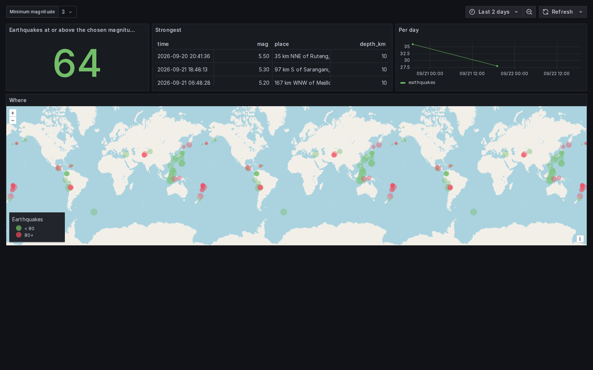

# Tutorial: a live feed in the browser

This builds the dashboard below from the USGS earthquake feed: a month of earthquakes, loaded **once**
into the browser, with the map, the table, the count and the daily series all answered locally.



Then it does the same thing two more ways, for the two cases the first one cannot cover: a feed that
does not allow browser reads, and one that wants a credential.

Every number here was measured on 2026-09-22, against Grafana 12.0.10 and the feed as it stood that
day: 10 707 earthquakes, 7.3 MB of GeoJSON. The feed is live, so your counts will differ.

## Before you start

You need a Grafana with Chaski installed, and the datasource provisioned. In this repository:

```bash
npm ci && npm run build
npm run server           # Grafana on :3005, fixtures on :8095
```

The finished dashboard is [`provisioning/dashboards/tutorial-earthquakes.json`](../provisioning/dashboards/tutorial-earthquakes.json),
already provisioned there as **Chaski · earthquakes tutorial**. Import it into your own Grafana if you
would rather read the result than build it.

## 1. The dataset

A dataset is a **query variable** of this datasource, hidden from the dashboard's toolbar. It loads
when the dashboard opens, and every panel reads it by name.

Create a variable of type _Query_, pick the Chaski datasource, and choose kind **Dataset**. Name it
`quakes`, source **SQL in the browser**, and give it this query:

```sql
SELECT
  to_timestamp(f.properties.time / 1000) AS time,
  f.properties.mag::DOUBLE AS mag,
  f.properties.place AS place,
  f.geometry.coordinates[1]::DOUBLE AS longitude,
  f.geometry.coordinates[2]::DOUBLE AS latitude,
  f.geometry.coordinates[3]::DOUBLE AS depth_km
FROM read_json('https://earthquake.usgs.gov/earthquakes/feed/v1.0/summary/all_month.geojson'),
     unnest(features) AS t(f)
WHERE f.properties.mag IS NOT NULL
```

`read_json` fetches the feed straight from the browser, which works because USGS answers with
`access-control-allow-origin: *`. `unnest(features)` turns the GeoJSON feature array into rows, and the
rest picks the fields out of each feature. GeoJSON coordinates are `[longitude, latitude, depth]`, in
that order — DuckDB lists are 1-based, hence `[1]`, `[2]`, `[3]`.

That load took **2.5 s** for 10 707 rows.

**Do this in a dataset, not in each panel.** Every `read_json` call fetches and parses the whole
document again: four panels would download the feed four times per refresh. Three such reads in one
session were enough to hit the browser's 1 GB memory limit and fail with `Out of Memory Error`. Loaded
once as a dataset, the same queries answer from memory in **7 to 200 ms**.

## 2. The panels

Every panel reads the dataset by name and filters by time itself:

```sql
-- Stat: how many
SELECT count(*)::DOUBLE AS n FROM $quakes WHERE mag >= $minmag AND $__timeFilter(time)

-- Table: the strongest
SELECT time, mag, place, depth_km FROM $quakes
WHERE mag >= $minmag AND $__timeFilter(time)
ORDER BY mag DESC LIMIT 10

-- Time series: per day
SELECT $__timeGroup(time, 1d) AS time, count(*)::DOUBLE AS earthquakes FROM $quakes
WHERE mag >= $minmag AND $__timeFilter(time)
GROUP BY 1 ORDER BY 1

-- Geomap: where
SELECT latitude, longitude, mag, depth_km, place FROM $quakes
WHERE mag >= $minmag AND $__timeFilter(time)
```

`$minmag` is an ordinary _Custom_ variable (`0, 2, 3, 4.5, 5`), and the map is Grafana's own **Geomap**
panel: columns named `latitude` and `longitude` are all it needs, so nothing extra has to be installed.

**`$__timeFilter(time)` is not optional.** The dataset holds the whole month, so a panel without it
answers the same whatever the dashboard's time range says — you move the range, drag a window on the
time series, and nothing changes anywhere else. The time range is the panels' job here, because the
dataset is loaded once and kept.

### What this buys you

Narrowing the range from 30 days to 2 days on the finished dashboard took the count from 1292 to 64,
and the map and table followed. Measured during that change: **1 dataset load, 4 new panel queries,
and 0 requests to usgs.gov**. The data never left the browser; only the questions changed.

## 3. When the feed does not allow browser reads

Most APIs do not send CORS headers, and the browser refuses to read them. Then the fetch happens on the
server, through another Grafana datasource, and Chaski turns its answer into the same dataset. The
[Infinity](https://grafana.com/grafana/plugins/yesoreyeram-infinity-datasource/) datasource does this
for any HTTP API.

Keep the variable, change its source to **Another datasource**, pick Infinity, and configure its query:
type JSON, source URL, parser **Backend**, rows selector `features`, and these columns:

| Selector                 | Name        | Format               |
| ------------------------ | ----------- | -------------------- |
| `properties.time`        | `time`      | Timestamp ms (epoch) |
| `properties.mag`         | `mag`       | Number               |
| `properties.place`       | `place`     | String               |
| `geometry.coordinates.0` | `longitude` | Number               |
| `geometry.coordinates.1` | `latitude`  | Number               |
| `geometry.coordinates.2` | `depth_km`  | Number               |

**Infinity indexes arrays with a dot**: `geometry.coordinates.0`. Written `geometry.coordinates[0]` the
column comes back empty, with no error to tell you why.

Nothing else changes: the panels still say `FROM $quakes`, and they are none the wiser. This load took
**6.0 s** for the same rows, against 2.5 s in the browser — the feed is fetched by the server, turned
into data frames, shipped as JSON and turned back into Arrow. That is the price of reaching an API the
browser cannot.

## 4. When the API wants a credential

A secret cannot live in a dashboard, where every viewer can read it. Grafana's data proxy holds it
instead: the browser asks Grafana, and Grafana adds the credential on its way out.

In the datasource settings, under **Proxy**, set the server's URL and its credential — basic auth, a
header such as `Authorization: Bearer …`, or a key in the query string. Then read through it with
`$__proxy`:

```sql
SELECT … FROM read_json($__proxy('quakes.geojson')), unnest(features) AS t(f)
```

`$__proxy('path')` becomes a URL under `/api/datasources/proxy/uid/<uid>/`, on Grafana's own origin, so
CORS does not apply either. The plugin declares GET and HEAD routes only, so a viewer cannot use the
proxy to write to that server.

To try it here, the repository's own fixtures server plays the part of a private API: it serves
`/bearer/` behind `Authorization: Bearer test-token` and sends no CORS headers, and the provisioned
datasource **Chaski · proxy bearer** is already configured for it.

```bash
node scripts/fetch-quakes.mjs    # saves a snapshot of the feed into fixtures/
```

Reading that snapshot through the proxy took **1.3 s**. A direct read of the same URL fails, as it
should: the browser blocks it and Chaski says the URL does not allow reads from the browser.

## Which one to use

| The server…                     | Use                          | Cost                                           |
| ------------------------------- | ---------------------------- | ---------------------------------------------- |
| allows CORS and needs no secret | `read_json` in the browser   | none: the browser fetches it directly          |
| does not allow CORS             | Infinity, or any datasource  | a server round trip, and JSON in between       |
| needs a credential              | the data proxy, `$__proxy`   | the bytes pass through Grafana                 |
| holds far more than you need    | the server DuckDB, Postgres… | aggregate there, and load the working set here |

## What to read next

- [`src/README.md`](../src/README.md) — the plugin's own page: datasets, SQL, macros, the proxy, limits.
- [`README.md`](../README.md) — how the plugin works inside, and how to develop it.
